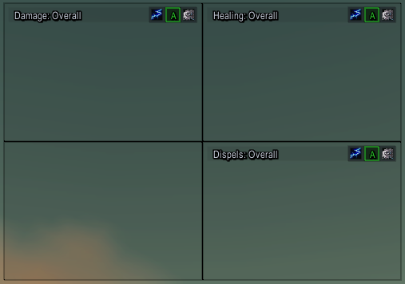
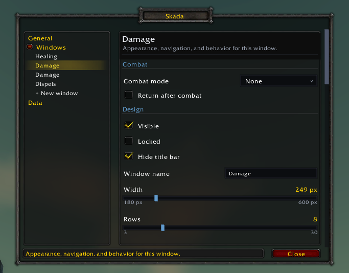

# Skada for OctoWoW

A lightweight, framework-free combat meter built specifically for the
OctoWoW Vanilla 1.12.1 client. Skada combines detailed combat analysis with
independent meter windows, fast drill-down navigation, and native in-game
configuration.

> [!IMPORTANT]
> `!!!ClassicAPI` is required. This addon is not compatible with an unmodified
> stock 1.12.1 client.

## Showcase

### Build a meter layout that fits your UI

Every window keeps its own mode, segment, size, position, and combat behavior.
Snap meters together into a compact dashboard, or hide their title bars for a
minimal presentation.

<p align="center">
  <a href="docs/images/skada-windows.png">
    
  </a>
</p>

<p align="center"><sub>Independent Damage, Healing, and Dispels views arranged in a snapped layout.</sub></p>

### Configure each window in-game

The native settings panel separates addon-wide appearance and data behavior
from each meter's mode, data source, automatic switching, and layout options.
Changes apply immediately, without an external configuration framework.

<p align="center">
  <a href="docs/images/skada-settings.png">
    
  </a>
</p>

<p align="center"><sub>Per-window controls are organized in a clear, scrollable settings panel.</sub></p>

## Features

### Combat analysis

- Damage, active-time DPS, damage taken, estimated effective healing, HPS,
  overhealing, dispels, interrupts, crowd control, deaths, and power gains.
- Spell, damaged-target, and healing-target drill-down views.
- Miss, dodge, parry, resist, immune, block, absorb, glancing, and crushing
  observations where the Vanilla combat text exposes them.
- Buff, debuff, and crowd-control application counts with observed uptime.
- Pet-to-owner merging, bounded fight history, Overall totals, and optional
  boss-only history retention.
- Best-effort death causes based on the most recent observed hit.

### Threat

- Live, target-specific Threat API v4 data from the OctoWoW server.
- Threat rank, aggro percentage, tank status, range state, and derived TPS.
- Threat rows follow the damage layout: threat `(TPS, aggro percentage)`.
- A clearly marked local estimate when a server reply is unavailable.
- Outside groups, only you and your pets appear in the estimate; threat
  queries are not sent while ungrouped.
- Player pinning when the server returns more rows than a window can display.

Threat is a live snapshot. It is intentionally unavailable for Overall and
saved-fight segments.

### Interface

- Multiple windows with independent modes, segments, positions, dimensions,
  visibility, locking, automatic segment switching, and snapping.
- Optional per-window combat mode switching (for example Threat in combat,
  Damage done out of combat) and a hideable title bar that collapses the
  window to its bars.
- Always-smooth bars, class colors and icons, spell colors, custom textures and
  fonts, configurable window and row borders, and self highlighting.
- A native settings panel and draggable minimap button; no Ace or display
  libraries are loaded at runtime.
- Chat reports to Guild, Party/Raid, Say, or Whisper.
- Optional client combat-file logging for Chronicle uploads.

## Installation

1. Install the ClassicAPI DLL and the `!!!ClassicAPI` addon.
2. Copy this project to `Interface/AddOns/Skada`.
3. Enable Skada on the character-selection addon screen.
4. Log in or run `/reload` after updating an existing installation.

## Using the meter

### Navigation

- Left-click an actor row to open its detail view.
- Right-click a row, the window header, or empty window space to go back
  through detail, mode, and fight views.
- Left-click the header to move forward through fight, mode, and meter views.
- With "Hide title bar" enabled, title-bar controls are unavailable from the
  meter; use `/skada` to change their settings. Right-click navigation and
  drag-to-move still work from the window.
- Click the lightning icon to open the mode list.
- Click `A` to toggle automatic segments: Current while in combat and Overall
  when out of combat.
- Use the mouse wheel to scroll non-threat views.
- Drag the header, any bar, the window background, or the lower-right resize
  grip while the window is unlocked.

The gear button opens window actions for settings, combat logging, reporting,
creating or removing windows, and resetting fight data. Dragged windows can
snap to screen edges or other visible Skada windows; the distance, gap, and
size matching behavior are configured per window.

### Minimap button

- Left-click: show or hide the active meter window.
- Right-click: open or close settings.
- Shift-left-click: request a full data reset.
- Drag: reposition the button around the minimap.

### Slash commands

| Command | Action |
| --- | --- |
| `/skada`, `/sk`, `/skada config` | Open settings |
| `/skada center` | Center and show the active window |
| `/skada status` | Print segment state, current damage, and parser misses |
| `/skada help` | Print command help |

## Settings

The settings panel applies changes immediately and is organized into two
areas:

- **General** contains every addon-wide behavior, appearance, data-retention,
  formatting, and reset setting.
- **Windows** contains one entry per meter window and only controls that
  window's behavior, dimensions, typography, mode, segment, and snapping.

Reset policies can ask, always reset, or never reset when entering an instance,
joining a group, or leaving a group. Skada never applies an automatic reset
while a segment is active.

## Accuracy and client limitations

### Performance

Skada uses CPU and memory to collect combat data; zero FPS impact cannot be
guaranteed. Display rebuilds run at most four times per second, rows are
reused, and group aura baselines are spread across tracking ticks. Newly
observed units may therefore take several ticks to establish an aura baseline
during a roster burst. Pending dispel snapshots still resolve immediately.

After updating, run `/reload`. To assess actual gameplay impact, compare frame
times with Skada enabled and disabled across several comparable fights using
the same graphics settings and other addons. A quiet scene alone does not
exercise raid combat processing. Host-side timing checks are available through
`python tests/benchmark.py`; they do not predict in-game FPS.

### Combat data

Vanilla does not provide `COMBAT_LOG_EVENT_UNFILTERED`, so Skada reads combat
from whichever of two sources the client offers.

**Nampower events, when available.** With Nampower loaded and raw GUIDs accepted
wherever a unit token is (the SuperWoW extension), Skada takes damage, healing,
power gains, misses, dispels and deaths straight from the server's own combat
packets: real GUIDs, real spell IDs, real amounts, no dropped chat lines and no
locale gaps. The chat routes for exactly those facts are suppressed so nothing is
counted twice. Interrupts, crowd control and aura uptime have no Nampower
equivalent and stay on the text parser. Turn this off under Settings, General,
"Use Nampower combat events". `docs/NAMPOWER.md` records the full mapping and
what remains unused.

**Localized combat text otherwise.** `CHAT_MSG_COMBAT_*` and `CHAT_MSG_SPELL_*`
formats are compiled once and routed to the events each can occur on, then
enriched with ClassicAPI unit, GUID, cast, aura, and creature information.
`/skada status` prints which source is live.

- Healing messages do not include overheal. Skada estimates effective healing
  from the target's readable health deficit at parse time. UI and combat-message
  updates can race, so effective healing and overhealing are always labelled as
  estimates. If health is unavailable, the full amount is retained as
  unverified effective healing. On the Nampower path the heal event carries the
  target's GUID, so that unit's health is read directly and the estimate is
  verified far more often.
- A boss fight is recognized from the server-authored boss creature rank or an
  engaged BigWigs encounter module. Player and group-member targets are scanned;
  players, pets, and elite trash do not qualify solely by level or appearance.
- The OctoWoW Threat API remains authoritative. The local fallback estimates
  damage and distributed healing threat and may use optional Nampower DBC
  fields, but it is not a substitute for the server table.
- Several avoidance and resource-gain messages use verified English patterns
  because matching client global-string names are unavailable. Other locales
  may under-count those specific facts; unmatched lines are ignored safely and
  included in `/skada status`. This applies to the text parser only. The
  Nampower events carry no text and are locale-independent.

Skada stores compact aggregates rather than a full combat timeline. Chronicle
serves the separate use case of retaining and analyzing `Logs/WoWCombatLog.txt`
outside the game.

## Development

The test suite loads files in the exact order declared by `Skada.toc`, runs
the addon against a mocked client API, and exercises parsing, aggregation,
segments, threat, window behavior, settings, and compatibility helpers. The
orchestrator in `tests/run_tests.py` runs the domain suites from `tests/suites/`
in a fixed order (`--list` prints it); suites share one mocked runtime, so
later suites build on earlier state.

```shell
python -m pip install -r requirements-dev.txt
python tests/run_tests.py
```

The test suite runs on Python 3.8+; the release tool in `tools/` requires
Python 3.10+ (CI pins 3.12).

See [ARCHITECTURE.md](ARCHITECTURE.md) for module contracts and extension
guidance. Third-party asset provenance is documented in
[THIRD_PARTY_NOTICES.md](THIRD_PARTY_NOTICES.md).

## Issues and contributing

Bugs and feature requests are tracked on
[GitHub Issues](https://github.com/cyberpmp/skada/issues). Before opening a new
issue, please search the existing ones — including closed issues — and add a
comment instead if your case is already tracked.

When reporting a bug, include:

- The Skada version (`/skada status` prints it) and where it came from (release
  zip or git checkout).
- Your client and load order: which OctoWoW build you run, and whether
  `!!!ClassicAPI`, BigWigs, and Nampower are enabled.
- The output of `/skada status`.
- What you expected, what happened instead, and the steps to reproduce it.
- If the addon fails to load or throws errors, an excerpt from
  `Logs/FrameXML.log` covering the affected files, plus any Skada error text
  printed in chat.

For meter-accuracy reports (wrong damage, healing, or threat numbers), describe
the encounter and attach the matching window of `Logs/WoWCombatLog.txt` if you
have combat logging enabled — it is the ground truth the parser can be checked
against.

Contributions are welcome via pull requests against `main`. Please run the
test suite before submitting (`python tests/run_tests.py`) and include it in the
PR; new behavior should come with coverage in `tests/suites/`. Keep new modules
consistent with the structure described in [ARCHITECTURE.md](ARCHITECTURE.md),
and note in the description which client features the change depends on, since
compatibility targets the OctoWoW 1.12.1 API specifically.

## Releasing

Releases are tag-driven. Update `## Version:` in `Skada.toc`, move the entries
from `## Unreleased` into a matching `## VERSION - YYYY-MM-DD` changelog
section, commit the change, and create a matching semantic-version tag:

```shell
git tag v1.0.0
git push origin main v1.0.0
```

The release workflow runs the test suite first — a failing suite blocks the
release — verifies that the tag matches the TOC version, and then creates
an install-ready `Skada/` package containing only the runtime, media, TOC, and
consolidated license notices. Repository and development documentation remain
outside the user-facing zip. The GitHub release description is extracted from
the matching `CHANGELOG.md` version section. If that heading has not been
created, the workflow falls back to `## Unreleased`; a missing or empty section
blocks the release instead of publishing an empty description.

## License

The project-authored addon code is Copyright (c) 2026 cyberpmp (PMP) and is
distributed under the [MIT License](LICENSE). Bundled fonts and textures retain
their upstream copyrights and licenses; see
[THIRD_PARTY_NOTICES.md](THIRD_PARTY_NOTICES.md).
